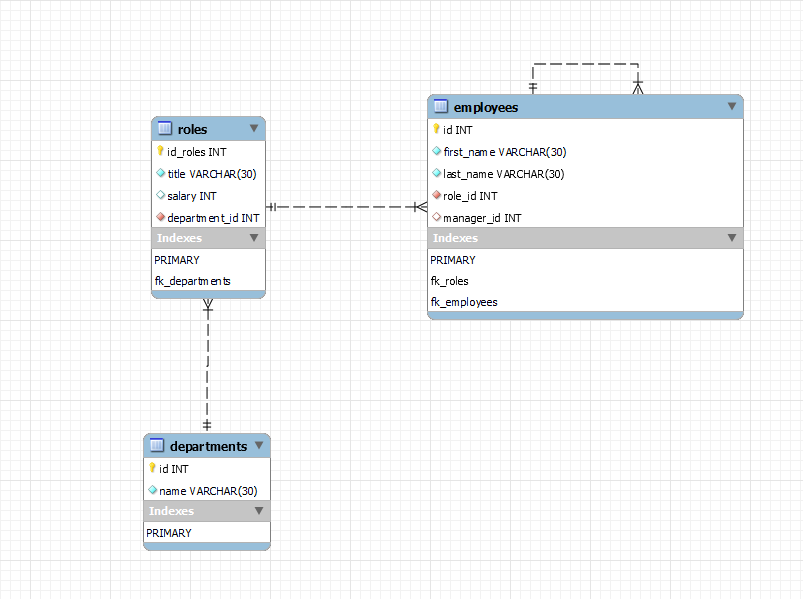

# Employee Tracker App

## Table of Contents

- [Employee Tracker App](#employee-tracker-app)
  - [Table of Contents](#table-of-contents)
  - [Licence](#licence)
  - [Description](#description)
  - [Schema](#schema)
  - [Installation](#installation)
  - [Usage](#usage)
  - [Future Developments](#future-developments)
  - [Questions](#questions)
  - [Link to GitHub repository](#link-to-github-repository)
  - [Link to Video Recording demonstrating the working application](#link-to-video-recording-demonstrating-the-working-application)

## Licence

MIT License

Copyright (c) 2021 Tudor Andrei Tocan

Permission is hereby granted, free of charge, to any person obtaining a copy
of this software and associated documentation files (the "Software"), to deal
in the Software without restriction, including without limitation the rights
to use, copy, modify, merge, publish, distribute, sublicense, and/or sell
copies of the Software, and to permit persons to whom the Software is
furnished to do so, subject to the following conditions:

The above copyright notice and this permission notice shall be included in all
copies or substantial portions of the Software.

THE SOFTWARE IS PROVIDED "AS IS", WITHOUT WARRANTY OF ANY KIND, EXPRESS OR
IMPLIED, INCLUDING BUT NOT LIMITED TO THE WARRANTIES OF MERCHANTABILITY,
FITNESS FOR A PARTICULAR PURPOSE AND NONINFRINGEMENT. IN NO EVENT SHALL THE
AUTHORS OR COPYRIGHT HOLDERS BE LIABLE FOR ANY CLAIM, DAMAGES OR OTHER
LIABILITY, WHETHER IN AN ACTION OF CONTRACT, TORT OR OTHERWISE, ARISING FROM,
OUT OF OR IN CONNECTION WITH THE SOFTWARE OR THE USE OR OTHER DEALINGS IN THE
SOFTWARE.

## Description

A command-line app that allows the user to kkep track of his company. There are three tables, roles, employees and departments.

## Schema

## Installation

- clone this repository into your local machine;

- open the repository location into your terminal;
- run `npm install` in your terminal;

- open your MySQL Workbench;

- copy - paste the schema and seed files into your MySQL Workbench following the instructions in the comments;
- to start the application type `npm run start` into your terminal;

## Usage

The user can:

- add employees, roles and departments;
- remove employees, roles and departments;
- update employee roles;
- view employees and their respective roles;

## Future Developments

- View total budget used by each department;
- View all employees under the same manager;
- View all employees that have the same role;

## Questions

For any questions regarding this app, please contact me via:

- Email at tudor.tocan@gmail.com
- GitHub at <https://github.com/ttudorandrei>

## Link to GitHub repository

You can view the GitHub Repository by clicking [here](https://github.com/ttudorandrei/employee-tracker)

## Link to Video Recording demonstrating the working application

You can view a recording of the working application by clicking [here](https://drive.google.com/file/d/1ujfFSBoUeQmi9RG-vltpNc8rJjq23omu/view)
